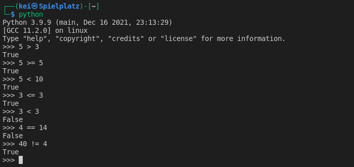
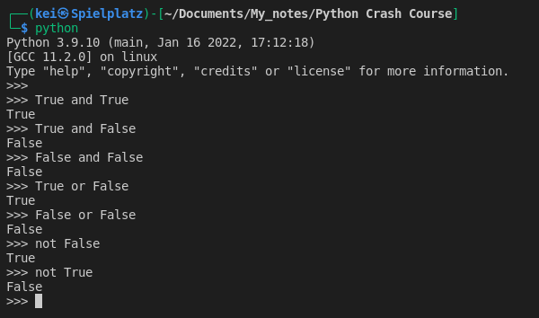

- __Booleans__ evaluate to __True__ or __False__ based on conditions:
		
    - Greater than > 
	- Greater than or equal to >=		
    - Less than <
	- Less than or equal to <=		
    - Equal to ==
	- Not equal to != 

- A __Truth table__ is used to carry out logical operations

