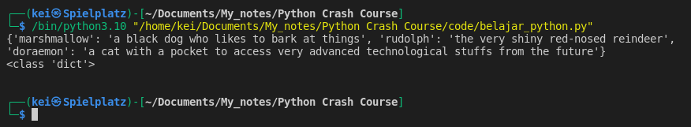
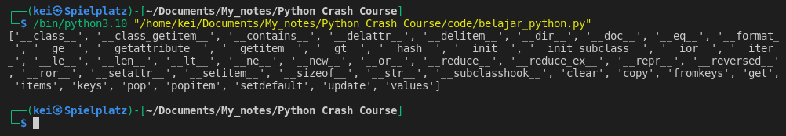
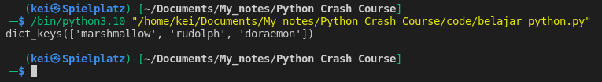
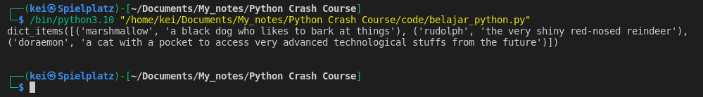
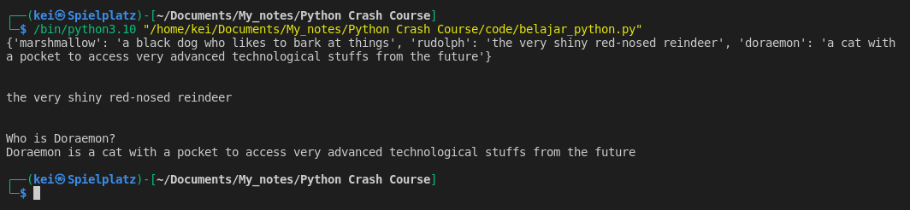
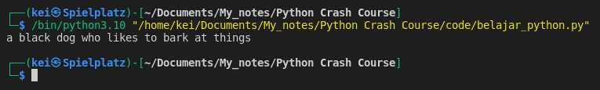
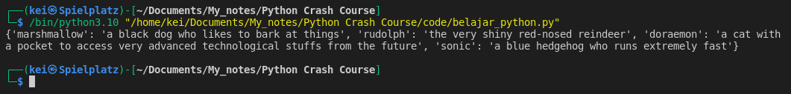
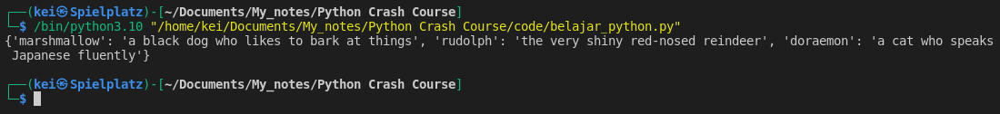
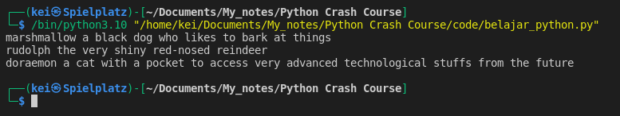

- __Dictionaries__ using key-value pair for the elements

- Example of a Dictionary

```python
animals = {
  	"marshmallow":"a black dog who likes to bark at things", 
    "rudolph":"the very shiny red-nosed reindeer",
    "doraemon":"a cat with a pocket to access very advanced technological stuffs from the future"
    }
```



- I can use __dir__ function to list the built-in methods and functions I can use to work with Dictionaries
```python
animals = {
		   "marshmallow":"a black dog who likes to bark at things", 
           "rudolph":"the very shiny red-nosed reindeer",
           "doraemon":"a cat with a pocket to access very advanced technological stuffs from the future"
}

print(dir(animals))
```




- I can use __keys__ method to see all the keys in a dictionary
```python
animals = {
    "marshmallow":"a black dog who likes to bark at things", 
    "rudolph":"the very shiny red-nosed reindeer", 
    "doraemon":"a cat with a pocket to access very advanced technological stuffs from the future"
    }

print(animals.keys())
``` 



- Similarly I can also use __values__ method to see all the values in a dictionary
```python
animals = {
    "marshmallow":"a black dog who likes to bark at things", 
    "rudolph":"the very shiny red-nosed reindeer", 
    "doraemon":"a cat with a pocket to access very advanced technological stuffs from the future"
    }

print(animals.values())
```


- To see both keys and values I can use __items__ method
```python
animals = {
    "marshmallow":"a black dog who likes to bark at things", 
    "rudolph":"the very shiny red-nosed reindeer", 
    "doraemon":"a cat with a pocket to access very advanced technological stuffs from the future"
    }

print(animals.items())
```



- I can access a certain value by using its key
```python
animals = {
    "marshmallow":"a black dog who likes to bark at things", 
    "rudolph":"the very shiny red-nosed reindeer", 
    "doraemon":"a cat with a pocket to access very advanced technological stuffs from the future"
    }

print(animals)
print("\n")

print(animals["rudolph"])
print("\n")

print(f"Who is Doraemon? \nDoraemon is {animals['doraemon']}")
```



- I can also use __get()__ function 
```python
animals = {
    "marshmallow":"a black dog who likes to bark at things", 
    "rudolph":"the very shiny red-nosed reindeer", 
    "doraemon":"a cat with a pocket to access very advanced technological stuffs from the future"
    }

print(animals.get('marshmallow'))
```



- To add an item to a dictionary I can do like so
```python
animals = {
    "marshmallow":"a black dog who likes to bark at things", 
    "rudolph":"the very shiny red-nosed reindeer", 
    "doraemon":"a cat with a pocket to access very advanced technological stuffs from the future"
    }

animals["sonic"] = "a blue hedgehog who runs extremely fast"

print(animals)
```



- To change the value of an item in a dictionary I can do like so
```python
animals = {
    "marshmallow":"a black dog who likes to bark at things", 
    "rudolph":"the very shiny red-nosed reindeer", 
    "doraemon":"a cat with a pocket to access very advanced technological stuffs from the future"
    }

animals['doraemon'] = "a cat who speaks Japanese fluently"

print(animals)
```



- To iterate through a dictionary I can use __For__ loop
```python
animals = {
    "marshmallow":"a black dog who likes to bark at things", 
    "rudolph":"the very shiny red-nosed reindeer", 
    "doraemon":"a cat with a pocket to access very advanced technological stuffs from the future"
    }

for key, val in animals.items():
    print(key,val)
```


