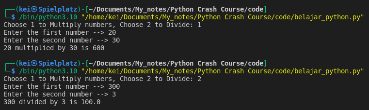
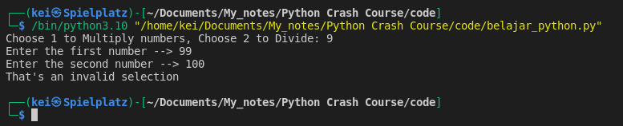
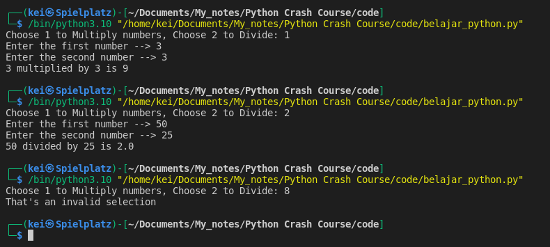
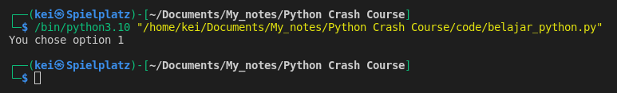
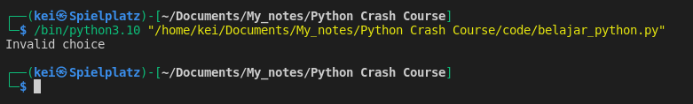
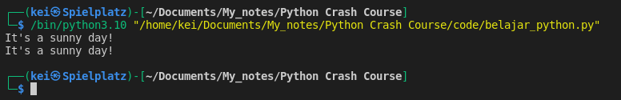

- With branching using __If__, __Elif__, or __Else statements__ I can control the execution of the code.
- The code block will only be executed if the condition is __True__.

```
if condition:
    run this code
elif other_condition_occured:
    run this code over here not the one above
else:
    run this code for anything else that don't meet the conditions above
```

- Example:

```python
option = input("Choose 1 to Multiply numbers, Choose 2 to Divide: ")

num1 = int(input("Enter the first number --> "))
num2 = int(input("Enter the second number --> "))

if option == "1":
	print(f"{num1} multiplied by {num2} is {num1 * num2}")
elif option == "2":
	print(f"{num1} divided by {num2} is {num1 / num2}")
else:
	print("That's an invalid selection")
```



- The usage of __if__, __elif__, and __else__ in the code above works fine if the user choose either option 1 or 2, but it will still prompt the user to enter the first number even when the user entered something else other than 1 or 2


- To fix this I can use __Nested If Statements__
```python
option = input("Choose 1 to Multiply numbers, Choose 2 to Divide: ")

if option == "1" or option == "2":
	num1 = int(input("Enter the first number --> "))
	num2 = int(input("Enter the second number --> "))
	if option == "1":
		print(f"{num1} multiplied by {num2} is {num1 * num2}")
	else:
		print(f"{num1} divided by {num2} is {num1 / num2}")
else:
	print("That's an invalid selection")
```


- Example:

```python
user_choice = "1"
paid = True

if user_choice == "1" and paid:
	print("You chose option 1")
elif user_choice == "2":
    print("You chose option 2")
else:
    print("Invalid choice")
```

- For __if__ statement to be executed, __user_choice__ and __paid__ both have to be __True__


- When __paid__ is changed to __False__ the __if__ statement will not be executed, it will go to check for the next statements and in this case it will run the __else__ statement
```python
user_choice = "1"
paid = False

if user_choice == "1" and paid:
    print("You chose option 1")
elif user_choice == "2":
    print("You chose option 2")
else:
    print("Invalid choice")
```


- Example:
```python
raining = True

a = "Bring an umbrella"
b = "It's a sunny day!"

if not raining:
	print(a)
else:
	print(b)
```
- This will execute the __else__ statement because the __if__ statement will check for the opposite value of __raining__ variable. 


- The code above can be simplified and written in one line using __Ternary operators__
```python
raining = True
a = "Bring an umbrella"
b = "It's a sunny day!"  

print(a) if not raining else print(b)

print(b) if raining else print(a)
```




- See the __Boolean Truth Table__ as reference
