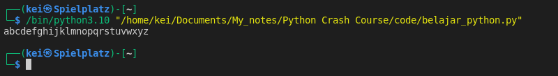
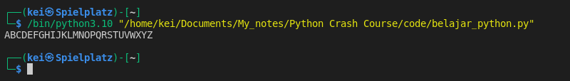

- To use a Python module I can import it by typing `import` followed by the name of the module. 
   This will import the module with all its functions and methods

```python
import string

print(string.ascii_lowercase)
```




- I can just import a particular method or function in a module instead of the whole module

```python
from string import ascii_uppercase
  
print(ascii_uppercase)
```



