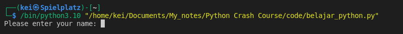
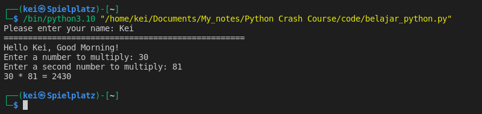

- The __Input function__ is used to take input from the user.

```python
user = input("Please enter your name: ")

print(50 * "=")

print(f"Hello {user}, Good Morning!")

first_num = input("Enter a number to multiply: ")
second_num = input("Enter a second number to multiply: ")
result = int(first_num) * int(second_num)

print(f"{first_num} * {second_num} = {result}")
```

- Because Python runs from top down, it will not execute the next line of code until I typed the input




