- I can use __For__ loop and __While__ loop for __Iteration__. They basically do about the same thing but the preferred method is using a __For__ loop.
- __For__ loop is typically use when iterating over a sequence of values (like a list or dictionary).

- Examples of Iteration using __For__ loop:
```python
some_nums = [2, 4, 88, 99, 101]
for num in some_nums:
    print(num)
```

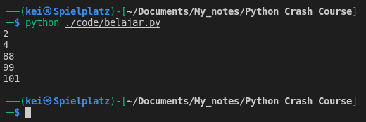

This will get the sum of all the integers value in a list :
```python
num_list = [30, 9, 19, 81, 94, 100, 5, 11, 44]

print(num_list)

sum_num_list = 0
for number in num_list:
    sum_num_list = sum_num_list + number
    
print(sum_num_list)
```

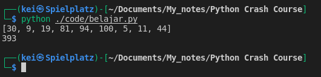

--- So first, I set the `sum_num_list` to 0, and `for` `number` `in` `num_list` will run a __For__ loop in the iterable list (`num_list`), for the first iteration the `number` will be 0 + 30, then the sum will add 9, and next will add 19 and it will keep adding up according to the element in `num_list` and the total will be captured in the `sum_num_list` 


- I don't have to use an iterable list to run a __For__ loop, using the __range()__ function I can generate numbers within certain range 
```python
for number in range(15):
    print(number)
```

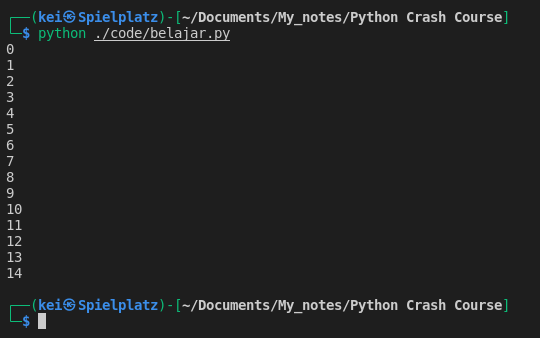
- I can use __range()__ to print out the the elements of  `num_list` based on the index, but the range has to match the elements that are in the list (can't exceeded)

```python
num_list = [30, 9, 19, 81, 94, 100, 5, 11, 44]

for number in range(9):
    print(num_list[number])
```

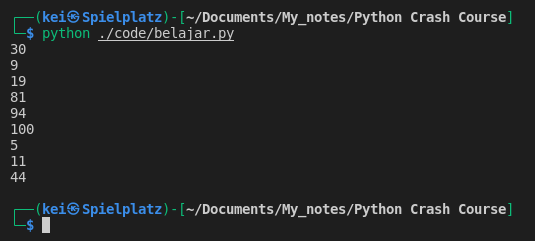

```python
num_list = [30, 9, 19, 81, 94, 100, 5, 11, 44]

for number in range(5):
    print(num_list[number])

print("\n")

for number in range(10):
    print(num_list[number])
```

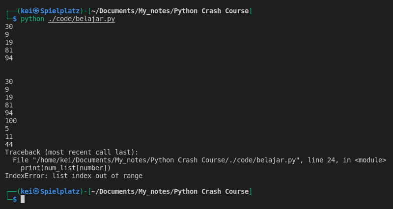

- In case I don't know how many elements are in the `num_list` I can still use __range()__ with __len()__ to find out how many elements in the list based on the index or I can just print them out.

```python
num_list = [30, 9, 19, 81, 94, 100, 5, 11, 44]

for num in range(len(num_list)):
    print(num)

print("\n")

for num in range(len(num_list)):
    print(num_list[num])
```

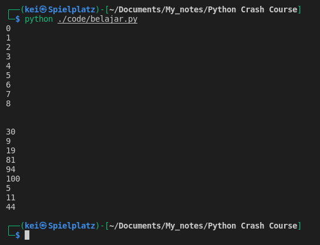

- Another way to get the sum of all the integers value in a list using range() with len()

```python
num_list = [30, 9, 19, 81, 94, 100, 5, 11, 44]
print(num_list)

print("\n")

sum_num_list = 0
for number in num_list:
    sum_num_list = sum_num_list + number
print(sum_num_list)

print("\n")

sum_num_list = 0
for number in range(len(num_list)):
    sum_num_list = sum_num_list + num_list[number]
print(sum_num_list)
```

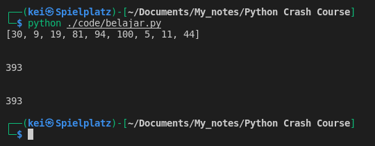

- When I'm  incrementing the value of a variable using the existing value, like with `sum_num_list = sum_num_list + number` I can write the short form of it as `sum_num_list += number` 

- For example if I don't know how many times I may run a code, I can get the run time from the input
```python
running = int(input("How many times do you want the code to run? "))
for num in range(running):
    print(f"Run: {num}")
```

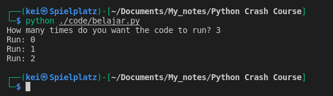

- By default the code will run from 0 so I have to add + 1

```python
running = int(input("How many times do you want the code to run? "))
for num in range(running):
    print(f"Run: {num + 1}")
```

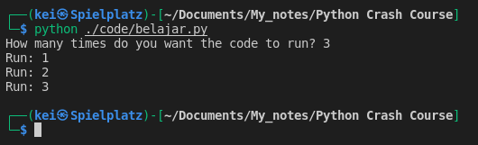

- To print out the items (both keys and values) in a dictionary I can use the __items()__ method. If I don't use __items()__ method it will only print out the keys. 
- The `item` in the dictionary will be returned as tuple.

```python
lang_dict = {"py":"python", "js":"javascript", "jl":"julia", "rs":"rust"}

# not using .items()
for item in lang_dict:
    print(item)

print('\n')

for item in lang_dict.items():
    print(item)
```

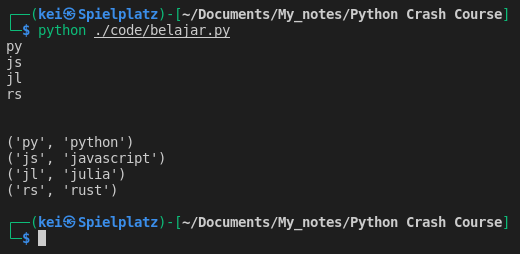

- Since `item` is returned as a tuple, I can unpack it
```python
lang_dict = {"py":"python", "js":"javascript", "jl":"julia", "rs":"rust"}

for item in lang_dict.items():
    key, value = item
    print(f"For the key {key}, the value is {value}")
```

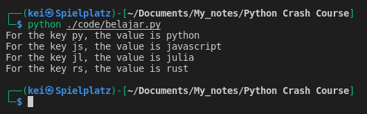

- Instead of using `item` variable to later unpack it to `key` and `value` I can just unpack it directly to `key` and `value`
```python
lang_dict = {"py":"python", "js":"javascript", "jl":"julia", "rs":"rust"}

for key, value in lang_dict.items():
    print(f"For the key {key}, the value is {value}")
```

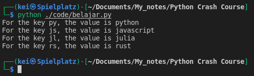


