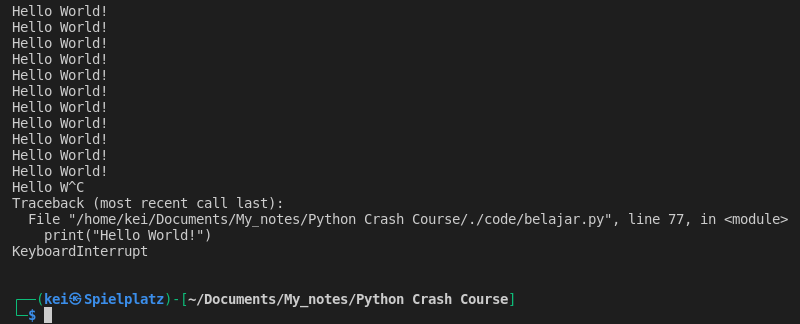
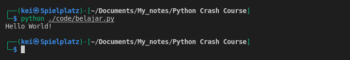
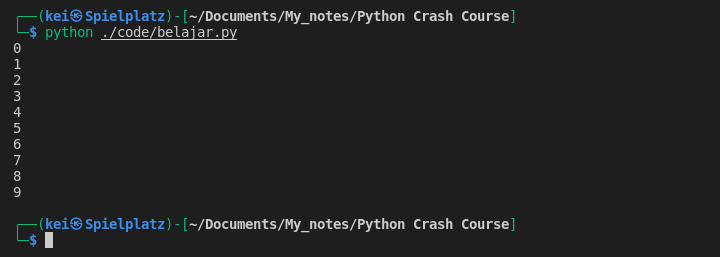
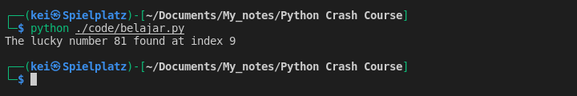

---
title: "Iterators - While Loop"
date: 2022-04-10T16:37:53-04:00
draft: false
cover:
    image: /images/python_logo.png
    alt: 'python logo'
    caption: 'Python'
resources:
    - src: "while-loop_infinite_loop.png"
      title: "While Loop Infinite loop"
    - src: "while-loop_break.png"
      title: "While Loop Break"
    - src: "while-loop_increment.png"
      title: "While Loop Increment"
    - src: "while-loop_luckynumber.png"
      title: "While Loop Lucky Number 81"
    - src: "for-loop_rangelen.png"
      title: "For loop Range Length"
    - src: "for-loop_runtime.png"
      title: "For loop Runtime"
tags: ["coding", "programming", "python", "iterator", "for", "loop", "while", "method", "function", "range", "len", "iteration", "randint"]
categories: ["Coding", "Programming Language"]
--- 

- __While__ loop can also be use for iteration but __while__ loop is typically use when looping over some condition
- Example of While loop
```python
some_condition = True

while some_condition:
    print("Hello World!")
```
-- This code will have an infinite loop, basically it will run forever until the computer crash. It will stop when I hit `Ctrl + C` to interrupt it, or if there is a `break` keyword somewhere in the code block.

```python
some_condition = True

while some_condition:
    print("Hello World!")
    break
```


- Another example of __while__ loop,

-- The code will stop running once the `number` is equal to 10
```python
number = 0
while number < 10:
    print(number)
    number += 1
```



- Example using __while__ loop to find a certain number within a range
```python
from random import randint

numbers = [randint(1,100) for number in range(200)]
iteration = 0
lucky_number = 81

while iteration < len(numbers):
    if numbers[iteration] == lucky_number:
        print(f"The lucky number {lucky_number} found at index {iteration}")
        break
    iteration += 1
```

