- __Lists__ using square brackets \[\]
- Example of Lists 
```python
int_list = [1, 20, 77, 800, 39, 21, 5]
str_list = ["python", "javascript", "java", "rust", "go", "dart"]

print(int_list)
print(type(int_list))

print(str_list)
print(type(str_list))
```

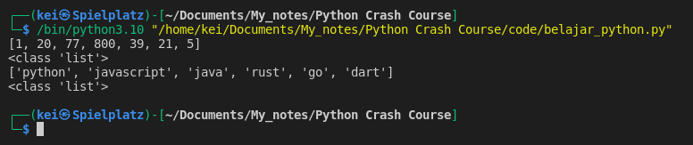


- Some of the things that I could do with lists:

	- Sort the values in ascending or descending order  
	- Find values in list or details about the list		
    - Insert or remove values from the list 
	- Get a sub-list from the list
	- Iterate through the list and perform functions or checks on each list item
		
- Some functions that could help me work with lists:
	- Sort : sort(), sorted()
	- Find : len(), min(), max(), count(), in, indexing, slicing
	- Insert/remove : append(), insert(), extend(), remove(), pop()		
	- Sub-lists : slicing, in-place, copying
    - Iteration : for loops, while loops


- I can use __dir()__ function to check for the built-in methods and functions available for __List__

```python
int_list = [1, 20, 77, 800, 39, 21, 5]

print(dir(int_list))
```

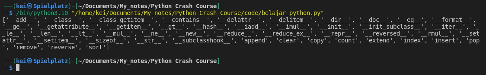

- Using __sorted()__ function to sort a list

```python
int_list = [1, 20, 77, 800, 39, 21, 5]
str_list = ["python", "javascript", "java", "rust", "go", "dart"]

print(f"Integers : {int_list}")
print(f"Strings: {str_list}")

sorted_int = sorted(int_list)
sorted_str = sorted(str_list)

print(sorted_int)
print(sorted_str)
```

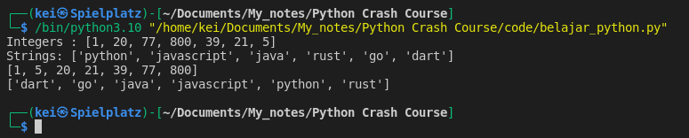

- Using __sort__ method to sort a list

```python
int_list = [1, 20, 77, 800, 39, 21, 5]
str_list = ["python", "javascript", "java", "rust", "go", "dart"]
  
print(f"Integers : {int_list}")
int_list.sort()
print(f"Integers : {int_list}")

print(f"Strings: {str_list}")
str_list.sort()
print(f"Strings: {str_list}")
```

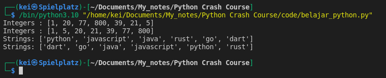

- Using __in__ to find information if a value is in a list

```python
int_list = [1, 20, 77, 800, 39, 21, 5]
str_list = ["python", "javascript", "java", "rust", "go", "dart"]

print(99 in int_list)
print("python" in str_list)
```

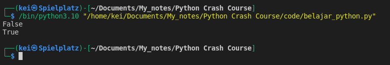

- Using __index__ method to find the location of a value in a list

```python
int_list = [1, 20, 77, 800, 39, 21, 5]
str_list = ["python", "javascript", "java", "rust", "go", "dart"]
  
print(int_list.index(800))
print(str_list.index("python"))

print(int_list.index(7)) #this will throw an error
```

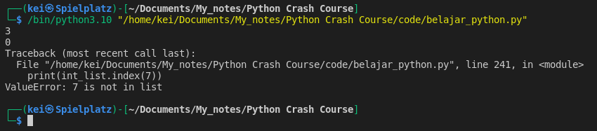

- Using __len()__ function to find the length of a list and get the last value in a list

```python
int_list = [1, 20, 77, 800, 39, 21, 5]
str_list = ["python", "javascript", "java", "rust", "go", "dart"]

print(len(int_list))
print(len(str_list))

print(int_list[len(int_list)-1])
```

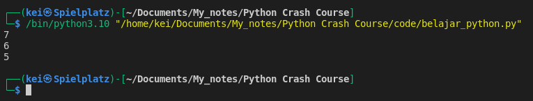

- Use __min()__ and __max()__ function to find the minimal or maximal value of an element

```python
int_list = [1, 20, 77, 800, 39, 21, 5]
str_list = ["python", "javascript", "java", "rust", "go", "dart"]
  
print(min(int_list))
print(max(int_list))

print(min(str_list))
print(max(str_list))
```

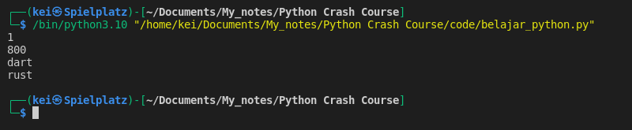

- Using __count__ method to find occurences of a certain value in a list

```python
int_list = [1, 20, 77, 800, 39, 21, 5, 81, 88, 15, 81, 10, 81]
str_list = ["python", "javascript", "go", "java", "rust", "go", "dart"]


print(int_list.count(81))
print(str_list.count("go"))
```

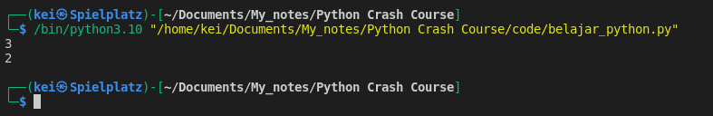

- Using __append__ method to add an element to the end of a list

```python
int_list = [1, 20, 77, 800, 39, 21, 5]
str_list = ["python", "javascript", "java", "rust", "go", "dart"]

  
int_list.append(81)
print(int_list)

str_list.append("kotlin")
print(str_list)
```

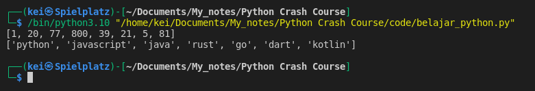

- Using __insert__ method to add an element to a certain position in a list

```python
int_list = [1, 20, 77, 800, 39, 21, 5]
str_list = ["python", "javascript", "java", "rust", "go", "dart"]

int_list.insert(3,81)
print(int_list)

str_list.insert(2,"kotlin")
print(str_list)
```

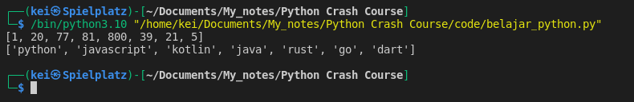

- Using __extend__ method to add a list to another list

```python
int_list = [1, 20, 77, 800, 39, 21, 5]
new_int_list = [81, 99, 30, 9, 15, 94]

str_list = ["python", "javascript", "java", "rust", "go", "dart"]
new_str_list = ["kotlin", "c++", "assembly", "julia"]


int_list.extend(new_int_list)
print(int_list)

str_list.extend(new_str_list)
print(str_list)
```

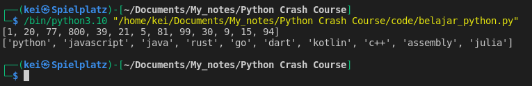

- Using __remove__ method to remove an element from a list

```python
new_int_list = [81, 99, 30, 9, 15, 94]
new_str_list = ["kotlin", "c++", "assembly", "julia"]

new_int_list.remove(99)
print(new_int_list)

new_str_list.remove("kotlin")
print(new_str_list)
```

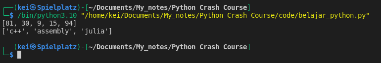

- Using __pop__ method to remove an element from a list

```python
new_int_list = [81, 99, 30, 9, 15, 94]
new_str_list = ["kotlin", "c++", "assembly", "julia"]

print(new_int_list.pop(1))
print(new_int_list)

print(new_str_list.pop(0))
print(new_str_list)
```

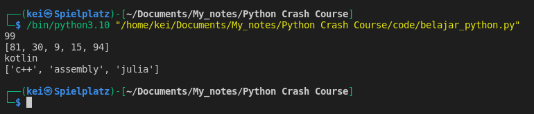

 - __List__ is mutable I can use indexing to change the element, reassign it to something else 

```python
new_int_list = [81, 99, 30, 9, 15, 94]
new_str_list = ["kotlin", "c++", "assembly", "julia"]

print(new_int_list[-1])
new_int_list[-1] = 100
print(new_int_list)

print(new_str_list[0])
new_str_list[0] = "python"
print(new_str_list)
```

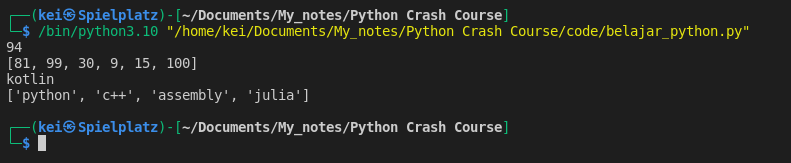


- I can also work with sub-list using slicing
```python
new_int_list = [81, 99, 30, 9, 15, 94]
new_str_list = ["kotlin", "c++", "assembly", "julia"]

new_int_list[-1] = 100

print(new_int_list)
print(new_int_list[:4])
print(new_int_list[1::2])

new_str_list[0] = "python"

print(new_str_list)
print(new_str_list[1:3])
print(new_str_list[::2])

```

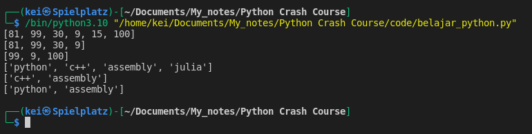


- I can iterate through list, example of using __for loop__

```python
new_str_list = ["python", "c++", "assembly", "julia", "dart", "go", "javascript"]

for element in new_str_list:
    print(element)
```

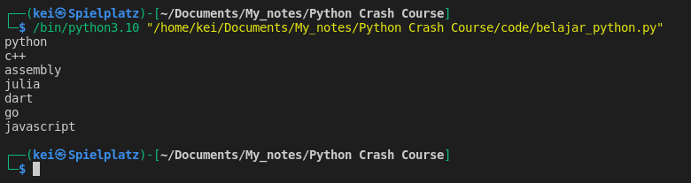