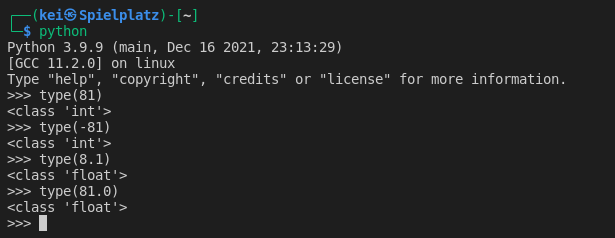
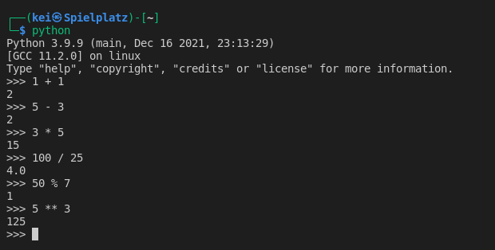
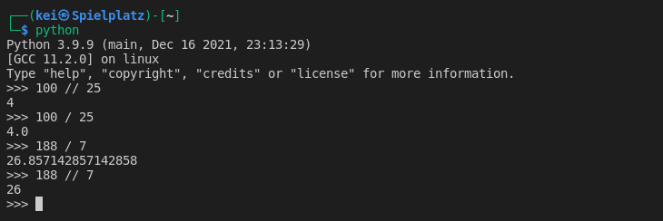
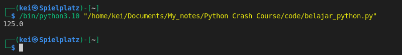
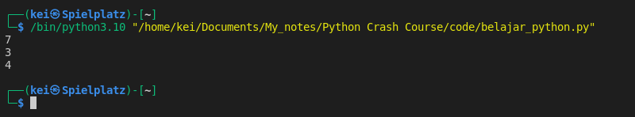
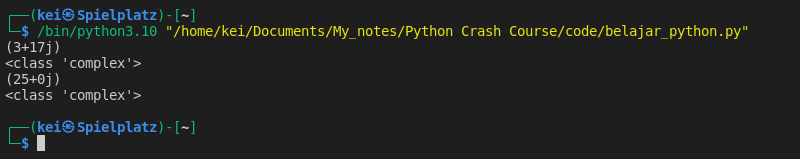

- Type of __Numbers__ :
	- __Integers__  :  Whole numbers
	- __Floats (Floating Point numbers)__ : Decimal numbers		
  - __Complex numbers__  : Numbers that have real and imaginary parts



- Some maths operations that can be done using Python are:
	
  -  Addition +   :  Adding numbers
	-  Subtraction -  :  Subtracting numbers
	-  Division /  :  Dividing numbers
	-  Multiplication *  :   Multiply numbers
	-  Exponential **  :  x to the power of y 
	-  Modulo %  :  Leftover number from division
	-  Floor division //  :  Returns the value of division without decimal points




- Example of Floor Division //


- There's a __math__ module that can be imported to perform mathematical operations on numbers

```python
import math

print(math.pow(5,3))
```



- I can also import the __random__ module and use the __randint__ to generate random integers

```python
import random

print(random.randint(1,10))
print(random.randint(1,10))
print(random.randint(1,10))
```



- __Complex numbers__ can be declared by direct assignment like *a = y + zj*. 
   y is a real number and z is imaginary number.
- Aside of direct assignment the __Complex function__ also can be used. It creates a complex number from a real part and an optional imaginary part. 
   This is equivalent to (real + imag * 1j) where imag defaults to 0.


```python
a = 3 + 17j

b = complex(6 + 19)

print(a)
print(type(a))

print(b)
print(type(b))
```



