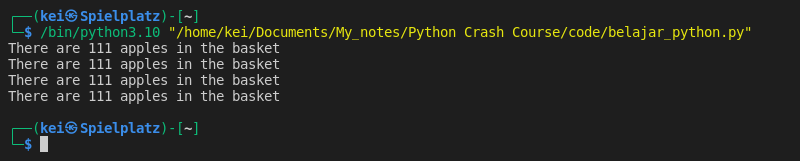

- There are several ways to output the result using __print()__

```python
apples_in_basket = "111"

print("There are " + apples_in_basket + " apples in the basket")
print("There are",apples_in_basket,"apples in the basket")
print("There are {} apples in the basket".format(apples_in_basket))
print(f"There are {apples_in_basket} apples in the basket")
```




