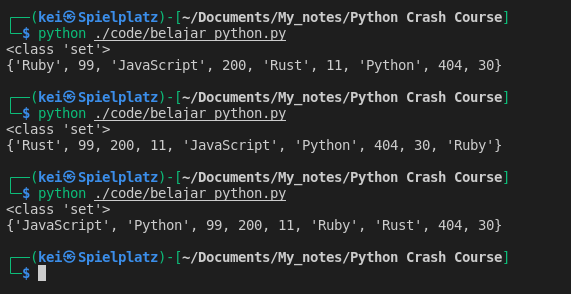
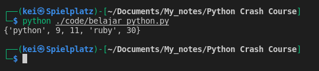
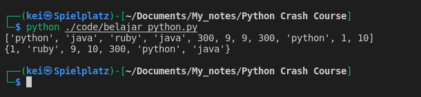
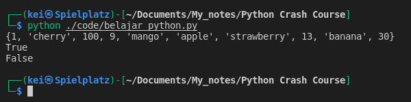
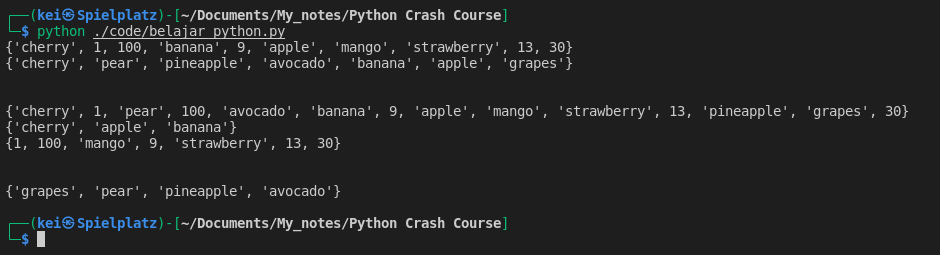
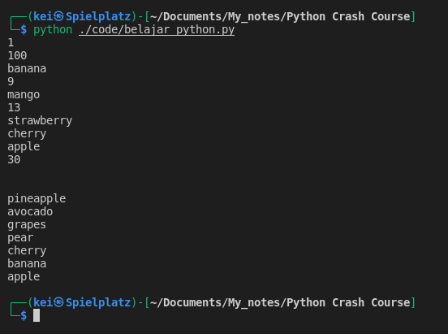

- __Sets__ using curly braces { }
- Example of a __Set__ : 
`mixed_set = {11, 200, 404, 30, "Python", "JavaScript", 99, "Ruby", "Rust"}`
- __Sets__ are unordered collection of elements, meaning that everytime I run the code the order of the items/elements will be print out randomly
```python
mixed_set = {11, 200, 404, 30, "Python", "JavaScript", 99, "Ruby", "Rust"}

print(type(mixed_set))

print(mixed_set)
```


- __Sets__ don't allow for duplicate elements
```python
duplicates = {11, 11, "python", "ruby", 30, 9, 30, "python"}

print(duplicates)
```


- If I have a __List__ with some duplicates items I can cast it to a __Set__ to remove them
```python
duplicate_list = ["python", "java", "ruby", "java", 300, 9, 9, 300, "python", 1, 10]

print(duplicate_list)

new_set = set(duplicate_list)

print(new_set)
```



- __Set__ is optimized for mainly to find information in them and for mathematical operations

- Example to find information in a __Set__
```python
new_mixed_set = {1, 30, "strawberry", "apple", 13, "cherry", 9, "mango", 100, "banana"}

print(new_mixed_set)

print("mango" in new_mixed_set)

print("blackberry" in new_mixed_set)
```



- Example of math operations on __Sets__ using __union__, __intersection__, and __difference__ methods
   - __Union__ method will return all the elements that are in either __Sets__
   - __Intersection__ method will return the elements that are in both __Sets__
   - __Difference__ method will return the differences of the __Sets__, all elements that are in this set but not the others  
```python
new_mixed_set = {1, 30, "strawberry", "apple", 13, "cherry", 9, "mango", 100, "banana"}
fruits_set = {"pineapple", "apple", "banana", "pear", "grapes", "cherry", "avocado"}


print(new_mixed_set)
print(fruits_set)

print("\n")

print(new_mixed_set.union(fruits_set))
print(new_mixed_set.intersection(fruits_set))
print(new_mixed_set.difference(fruits_set))

print("\n")

print(fruits_set.difference(new_mixed_set))
```



- To iterate through a __Set__ I can use __For__ loop
```python
new_mixed_set = {1, 30, "strawberry", "apple", 13, "cherry", 9, "mango", 100, "banana"}
fruits_set = {"pineapple", "apple", "banana", "pear", "grapes", "cherry", "avocado"}

for element in new_mixed_set:
    print(element)

print("\n")

for item in fruits_set:
    print(item)
```

