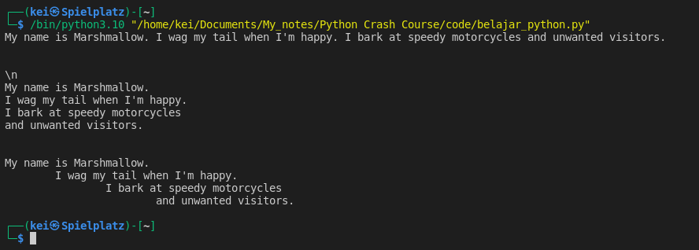

- Special characters in strings are:
	-  __\ (Backslash)__ : an escape character
	-  __\n__ : specifies new line within the string 
	-  __\t__ : adds a tab  

```python
print("My name is Marshmallow. \

I wag my tail when I'm happy. \

I bark at speedy motorcycles \

and unwanted visitors.")

  
print("\n")

print("\\n")
  
print("My name is Marshmallow.\nI wag my tail when I'm happy.\nI bark at speedy motorcycles\nand unwanted visitors.")

print("\n")

print("My name is Marshmallow.\n\tI wag my tail when I'm happy.\n\t\tI bark at speedy motorcycles\n\t\t\tand unwanted visitors.")
```



