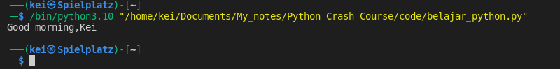
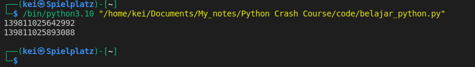
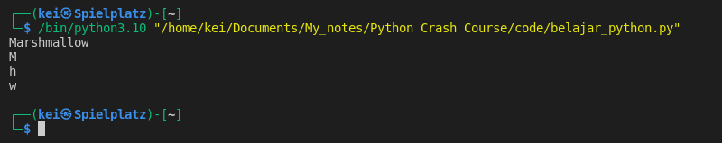
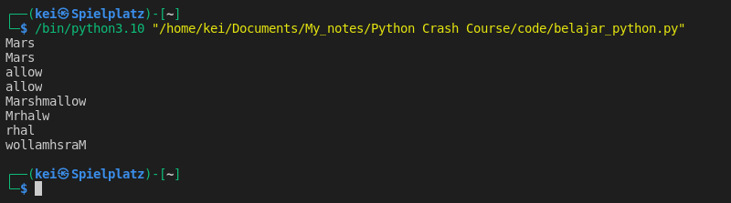

### Concatenation

- __Strings__ can be added to each other

```python
name = "Kei"
message = "Good morning,"

print(message + name)
```




- __Strings__ are immutable, it can't be changed although it can be reassigned with the same variable name but they are stored in different memory location

```python
name = "Kei"
message = "Good morning,"
print(id(message))

message = message + " " + name
print(id(message))
```





### Indexing

- __Strings__ are sequence of characters therefore they can be indexed.
The first character is at index 0. I can access the last character using index -1
```python
dog_name = "Marshmallow"

print(dog_name)
print(dog_name[0])
print(dog_name[4])
print(dog_name[-1])
```




### Slicing

- __Slicing__ gives me a sub-string based on the indexes I provided.

	- To access the sub-string "Mars", I have to provide the start index 0 and the stop index +1

	- If the starting index is 0, I can leave it empty.

	- To access "allow", I start at index 6 all the way to the end of the string, so there's no stop index +1. In that case I can leave it empty.

    - I can also start from the last index by using negative index notation.

	- Aside of the start and stop+1 index, I can also provide the step size. By default the step size is one.

```python
dog_name = "Marshmallow"

print(dog_name[0:4])
print(dog_name[:4])

print(dog_name[6:])
print(dog_name[-5:])

print(dog_name[::])
print(dog_name[::2])
print(dog_name[2:10:2])
print(dog_name[::-1])
```


