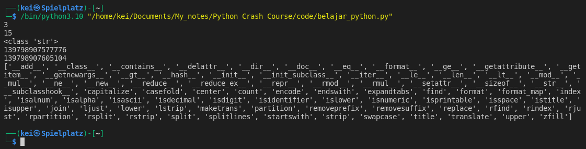
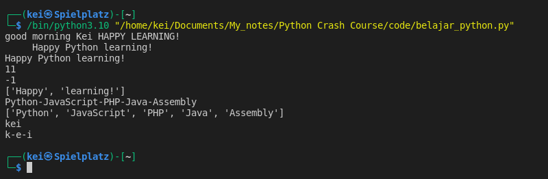

### Methods and Functions to use on Strings

- The Python Standard Library is the standard library that is distributed with Python. This library reference manual is available at [Python Standard Library](https://docs.python.org/3/library/) 
- Some of the functions and methods I can use on string objects are:
    -  len(), type(), id(), capitalize(), upper(), lower(), strip(),
		     find(), split(), join()	

- __Functions__ do not tied to the object. I have to type the function name followed by parentheses and pass in the object as an argument.
	-  len() - function, will give the length of the string including the whitespaces
	-  type() - function, will give the type of data (e.g string, int, float, etc)
	-  id() - function, will give the integer representation of the memory location for the 
             object that is passed-in
	-  dir() - function, will list all the built-in methods that can be run on the type of object 
             that is passed as an argument

 
```python
greeting = "Good morning"
name = "kei"
message = "Happy learning!"

print(len(name))
print(len(message))
print(type(greeting))
print(id(name))
print(id(message))
print(dir(name))
```




- __Methods__ are tied to the objects. To run a method I first have to provide an object followed by a .(dot) to chain the method to it.
 	-  capitalize() - method. Returns a capitalized version of the string, make the first character have upper case and the rest lower case
	-  upper() - method. Returns an uppercase version of the string
	-  lower() - method. Returns a lowercase version of the string
	-  strip() - method. Returns  the string with leading and trailing whitespace removed.
	-  find() - method. Returns the index where the string starts. When it can't find it on the object it will returns -1
	-  split() - method.  Returns a list of the words in the string, using separator as the delimiter string. By default the separator is whitespace.
	-  join() - method. The string whose method is called is inserted in between each given string. The result is returned as a new string.


```python
greeting = "Good morning"
name = "kei"
message = "Happy learning!"
new_message = " Happy Python learning! "
programming_languages = "Python-JavaScript-PHP-Java-Assembly"

print(greeting.lower(), name.capitalize(), message.upper())

print(new_message)
print(new_message.strip())

print(new_message.find('Python'))
print(greeting.find("Evening"))

print(message.split())
print(programming_languages)
print(programming_languages.split("-"))

print(name)
print("-".join(name))
```





