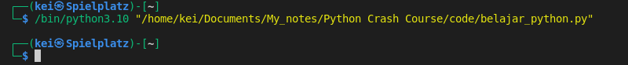
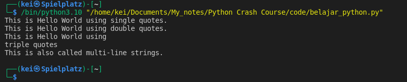
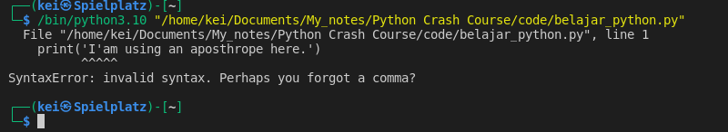
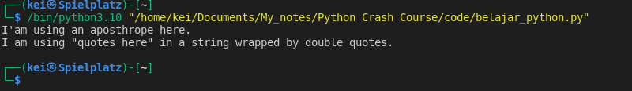

- __Strings__ in Python can be represented by wrapping them by using ' ' (single quotes), " "(double quotes), or ''' ''' (triple quotes)

```python
'This is Hello World using single quotes.'

"This is Hello World using double quotes."

"""This is Hello World using

triple quotes

This is also called multi-line strings."""

```



- To display the string as an output to the screen I can use Python bulit-in function, __print()__
```python
print('This is Hello World using single quotes.')

print("This is Hello World using double quotes.")

print("""This is Hello World using

triple quotes

This is also called multi-line strings.""")
```



- There will be a syntax error if I'm using an apostrophe in a string that is wrapped by single quotes, likewise I also will get a syntax error when I use quotes in a string that is wrapped by double quotes.
```python
print('I'am using an aposthrope here.')
```



- This error can be prevent by using the escape character \ (backslash). 
Without the backslash, the apostrophe and quotes are seen by Python as the end of the string. 
```python
print('I\'am using an aposthrope here.')

print("I am using \"quotes here\" in a string wrapped by double quotes.")
```




