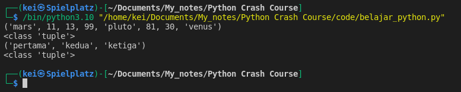
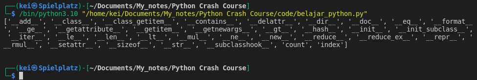
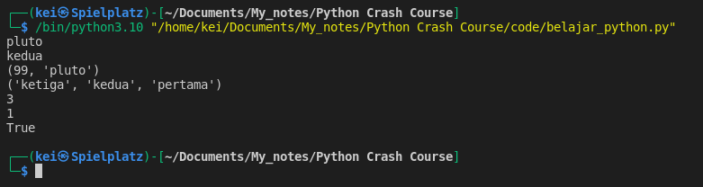
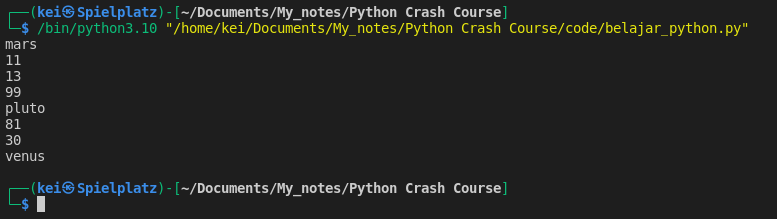
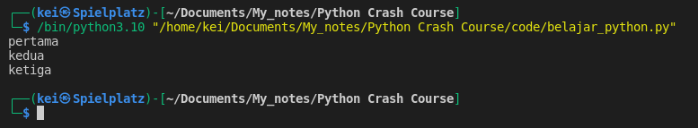

- __Tuples__ using parentheses ( )

- Example of Tuples

```python
mixed_tuple = ("mars", 11, 13, 99, "pluto", 81, 30, "venus")
tup_str = ("pertama", "kedua", "ketiga")

print(mixed_tuple)
print(type(mixed_tuple))

print(tup_str)
print(type(tup_str))
```




- To list all the built-in methods and functions available for Tuple, I can use __dir__()
```python
mixed_tuple = ("mars", 11, 13, 99, "pluto", 81, 30, "venus")

print(dir(mixed_tuple))
```



- Tuple works similar like List, except that Tuple is immutable. 
- Some of the operations that I can perform on a List I can also do on a Tuple

```python
mixed_tuple = ("mars", 11, 13, 99, "pluto", 81, 30, "venus")

tup_str = ("pertama", "kedua", "ketiga")

# indexing
print(mixed_tuple[4])
print(tup_str[-2])

# slicing
print(mixed_tuple[3:5])
print(tup_str[::-1])

# find the length
print(len(tup_str))

# count the number of occurences
print(mixed_tuple.count(81))

# find a value in tuple
print("venus" in mixed_tuple)
```




- To iterate through a Tuple I can use __For loop__

```python
mixed_tuple = ("mars", 11, 13, 99, "pluto", 81, 30, "venus")

for item in mixed_tuple:
    print(item)
```



- One of a useful case of Tuple's immutability is if I want to pass a value that I don't want to be changed I can use Tuple for that

- Example of Tuple unpacking
```python
tup_str = ("pertama", "kedua", "ketiga")

first, second, third = tup_str

print(first)
print(second)
print(third)
```




