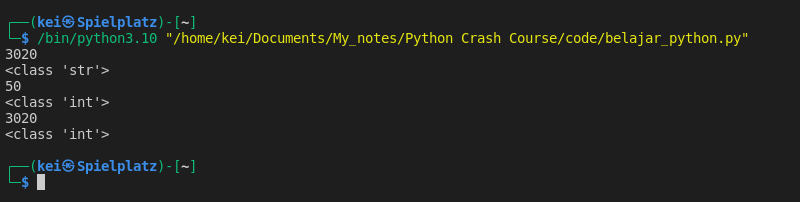
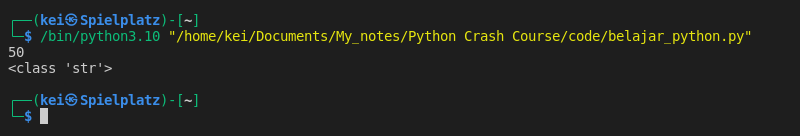
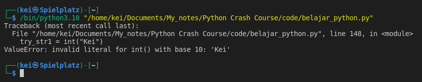

- __Type casting__ is the process of converting one data type to another data type, like a string to an integer or float and vice versa.
- Example:
```python
num_string1 = "30"
num_string2 = "20"
num_strings = num_string1 + num_string2

print(num_strings)
print(type(num_strings))

  
nums_typecast = int(num_string1) + int(num_string2)
print(nums_typecast)
print(type(nums_typecast))

  
try_typecast = int(num_string1 + num_string2)
print(try_typecast)
print(type(try_typecast))
```



- In the code above, the data type of __num_string1__ and __num_string2__ are strings so when they are added using __+__ operator, the result will just be a string concatenation and the data type is still a string. 
   To convert the string to an integer I can use __int()__. The conversion has to happen before the operation like __int(num_string1) + int(num_string2)__. 
   In the example of __try_typecast__, the operation of __num_string1 + num_string2__ has already happened before the conversion to integers, so it will convert the result of the string concatenation.

-  I can also convert integers to strings like so:
```python
num_int1 = 30
num_int2 = 20

num_ints = (str(num_int1 + num_int2))

print(num_ints)
print(type(num_ints))
```



- I can only convert strings that have integers representation 
```python
try_str1 = int("Kei")
try_str2 = 30

print(try_str1 + try_str2)
```



