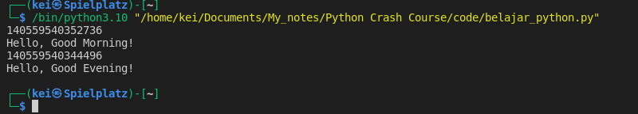

- __Variables__ are memory location references which store values

```python
morning_message = "Hello, Good Morning!"

evening_message = "Hello, Good Evening!"

print(id(morning_message))
print(morning_message)

print(id(evening_message))
print(evening_message)
```




- __Variable Name Rules__ :
	1. A variable name must start with a letter or an underscore
	2. Can only contain alphanumeric characters (A-Z, a-z, 0-9) and underscores (\_)
	3. Case sensitive